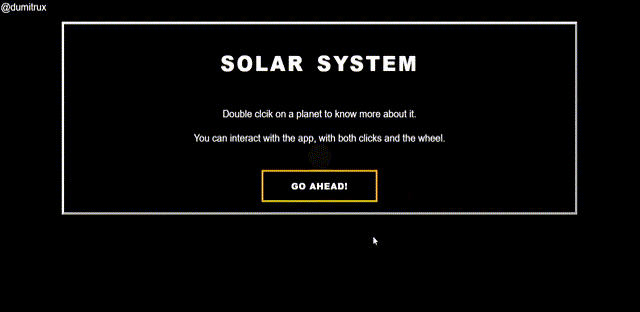

# Solar System threejs
A way to interact with the solar system and learn more about it.

Go and play with it!

**https://dumitrux.github.io/solar-system-threejs**

## Table of content
* [Motivation](#Motivation?)
* [Development](#Development)
* [Collaborate](#Collaborate)
* [License](#license)
* [Author](#author)

## Motivation
It is a base project to learn more about three.js.

The chosen topic (the solar system) is because I like everything related to the universe. Besides, I think that the best way to learn something is interacting and doing.

## Development
Made with [three.js](https://threejs.org/). A JavaScript 3D library, with a default WebGL renderer.

Based on:
* [threejsfundamentals](https://threejsfundamentals.org/)
* [Organize Three.js code](https://medium.com/@soffritti.pierfrancesco/how-to-organize-the-structure-of-a-three-js-project-77649f58fa3f)
* [Another solar system example](https://marshalmurphy.com/blog/2020-07-29-solar-system/)
* [Source of information (NASA)](https://solarsystem.nasa.gov/planet-compare/)
* [three.js examples](https://threejs.org/examples/#webgl_animation_cloth)

## Collaborate
In case if you want to collaborate here are some extra things that it would be great to add to the project :)

* **Event bus**: To decouple the components of an application.
* **One source of information**
* **Add dat.GUI**
* **A fancier modal**
* **More content**
* **Center the planet on double-click**

## License
MIT License

## Author
Danci, Marian Dumitru ([@dumitrux](https://github.com/dumitrux))